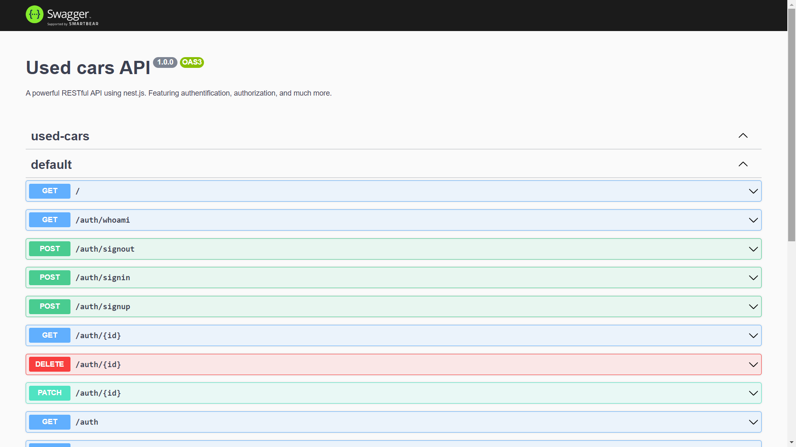

# Overview

This is a used cars RESTful API built with NestJS - inspired by [@StephenGrider](https://www.udemy.com/user/sgslo/). Users can use common auth features (signin/signup/etc.), as well as submitting reports for an estimate of the car they want to buy. Admins should approve reports before they go public.

# Goal 🎯

The main purpose of this project was to learn the fast node.js framework, NestJS. Here are some goals I attained along the way:

- Setting up authentication from scratch
- Encrypting user passwords using a salt and hash
- Using cookies to signin/signout users from the app
- Creating a repository from an entity using TypeORM
- Using DTOs to communicate and validate response data
- Creating a custom middleware to get current user anywhere in the app
- Implementing unit tests and e2e tests from scratch
- Building a custom serialize interceptor to use DTOs
- Using guards to restrict access to protected routes
- Creating complex queries with TypeORM
- Using sqlite in a dev/test environment, and PostgreSQL in production

# How it works ⚗️

I've used `swagger` with this app, which is a tool that lets you try out the API routes directly by accessing the `/api` route in the browser.

This is especially handy to avoid using third party services like `postman` and `insomnia` in every take.

Feel free to try it out, website link in the description.

# Used backend technologies ✨

This project uses a lot of server technologies such as:

- NestJS
- Typescript
- TypeORM
- sqlite & PostgreSQL
- Jest
- Swagger
- NodeJS

## Author
- [@achrafdev](https://achrafdev.com)

**Thanks for sharing** 🚀

